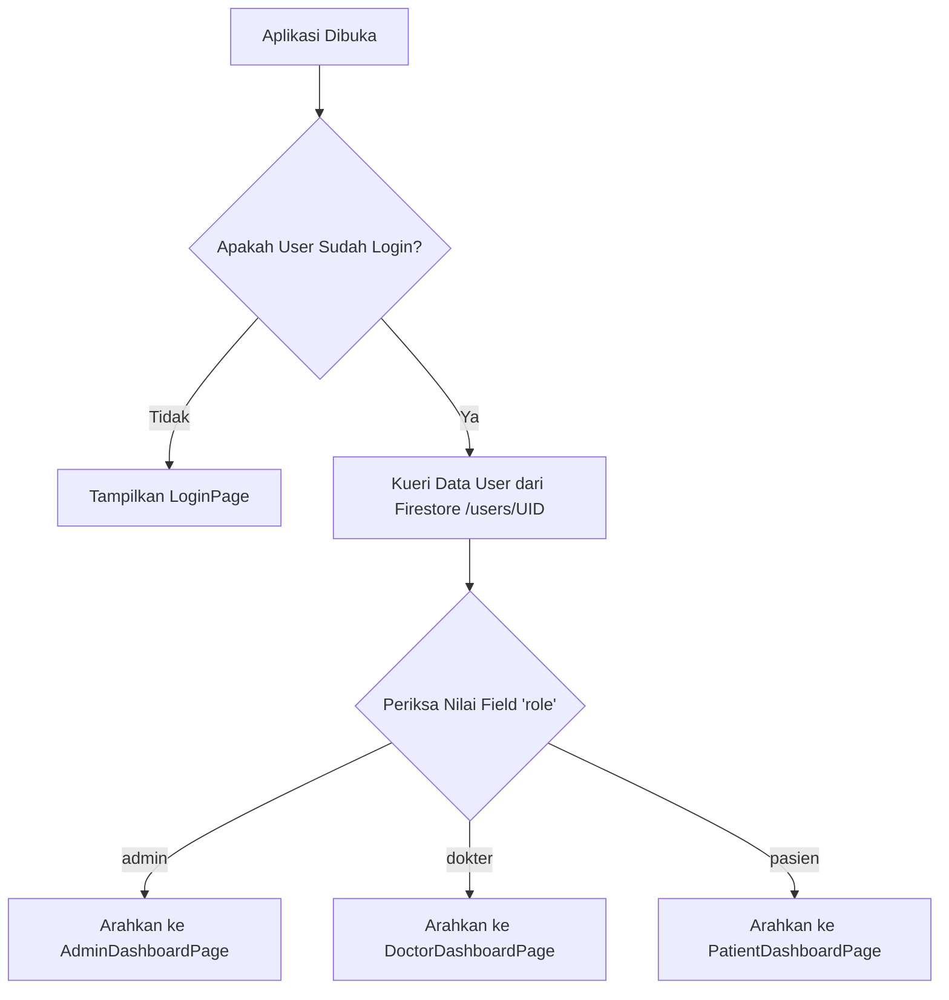

# 🏥 Heal Sync - Aplikasi Layanan Kesehatan Digital

**Heal Sync** (`rumahsakitapp`) adalah sebuah sistem manajemen dan layanan kesehatan digital berbasis mobile yang dikembangkan menggunakan **Flutter** dan terintegrasi dengan **Firebase** sebagai backend utama. Aplikasi ini dirancang untuk meningkatkan efisiensi pelayanan rumah sakit, mempermudah antrean pasien secara real-time, menyederhanakan pencatatan rekam medis oleh dokter, serta memfasilitasi admin dalam pengelolaan data operasional rumah sakit secara aman, terstruktur, dan transparan.

---

## 🚀 Fitur Utama & Pembagian Akses (Role-Based)

Aplikasi Heal Sync menerapkan sistem **Role-Based Access Control (RBAC)** yang membagi otorisasi akses menjadi tiga peran utama: **Pasien**, **Dokter**, dan **Admin**.

### 👤 1. Fitur Pasien (Patient Role)
*   **Registrasi & Login**: Autentikasi aman terintegrasi dengan Firebase Auth, menyimpan NIK, Nama Lengkap, dan Tanggal Lahir.
*   **Pilih Poli & Dokter**: Navigasi pemilihan spesialisasi (Poliklinik) dan dokter yang sedang bertugas.
*   **Booking Online**: Pendaftaran antrean dengan memilih tanggal dan jam kunjungan. Sistem mengunci antrean aktif agar tidak terjadi duplikasi pendaftaran di hari yang sama.
*   **Antrean Real-Time (Live Queue)**: Memantau nomor antrean berjalan secara langsung dan estimasi sisa antrean sebelum giliran pasien dipanggil.
*   **Dompet Digital (Wallet/Saldo)**: Sistem saldo internal untuk membayar rekam medis dan biaya pengobatan. Pembayaran diproses dengan Firebase Firestore Transaction untuk memastikan konsistensi saldo.
*   **Rekam Medis Pasien**: Riwayat riwayat medis lengkap, termasuk diagnosa, resep obat dari dokter, biaya tindakan, dan status pembayaran (Lunas/Pending).

### 🩺 2. Fitur Dokter (Doctor Role)
*   **Dashboard Dokter**: Melihat daftar pasien yang mengantre pada hari berjalan secara berurutan berdasarkan nomor antrean.
*   **Kelola Jadwal Praktik**: Mengatur jam operasional dan ketersediaan praktik.
*   **Input Rekam Medis**: Membuat catatan medis pasien setelah melakukan pemeriksaan yang meliputi diagnosa, resep obat, tindakan medis, serta menentukan total biaya layanan yang otomatis merubah status booking menjadi selesai (`done`).

### 🔑 3. Fitur Admin (Admin Role)
*   **Dashboard Admin**: Monitoring total statistik rumah sakit seperti total dokter, total rekam medis, dan total transaksi keuangan.
*   **Manajemen Dokter**: Menambahkan data dokter baru, mengunggah foto profil dokter ke Firebase Storage, serta mengedit detail ketersediaan dan bidang spesialisasi.
*   **Manajemen Akun & Keamanan**: Mengontrol privasi keamanan data serta memvalidasi rekam medis yang diterbitkan.

---

## 🛠️ Stack Teknologi

*   **Framework Utama**: [Flutter (Dart SDK ^3.9.2)](https://flutter.dev)
*   **UI Design & Typography**: Material Design, Cupertino Icons, [Poppins Font](https://fonts.google.com/specimen/Poppins), & [Lucide Icons](https://lucide.dev)
*   **Backend & Database**:
    *   **Firebase Authentication**: Pendaftaran & login aman.
    *   **Cloud Firestore**: Basis data NoSQL real-time untuk sinkronisasi antrean & riwayat medis.
    *   **Firebase Storage**: Penyimpanan aset media seperti foto profil dokter dan berkas pendukung.
*   **Notifikasi**: `flutter_local_notifications` untuk peringatan lokal real-time (misal: saat giliran antrean berjalan).
*   **Utilitas Tambahan**:
    *   `intl` untuk lokalisasi format tanggal dan mata uang Rupiah (`id_ID`).
    *   `image_picker` untuk pengambilan foto dokter dari kamera/galeri.
    *   `flutter_native_splash` untuk kostumisasi Splash Screen awal.
    *   `flutter_launcher_icons` untuk kustomisasi logo ikon aplikasi di perangkat mobile.

---

## 📂 Struktur Folder Proyek

Proyek ini terorganisir dengan rapi mengikuti arsitektur modular yang memisahkan antara model data, halaman antarmuka (UI), rute navigasi, dan layanan komunikasi backend:

```text
lib/
├── firebase_options.dart      # Konfigurasi otomatis Firebase platform-specific
├── main.dart                  # Titik masuk utama aplikasi (Main Entry Point) & AuthWrapper
├── model/                     # Model data / representasi entitas database
│   ├── bookings_model.dart    # Model antrean / reservasi kunjungan pasien
│   ├── doctor_model.dart      # Model informasi dan profil dokter
│   ├── medical_record_model.md # Model rekam medis pasien
│   └── user_model.dart        # Model profil pengguna (pasien, dokter, admin)
├── pages/                     # Antarmuka Layar (Screens) dibagi berdasarkan Role
│   ├── admin/                 # Layar khusus Admin (Dashboard, Kelola Dokter, dsb.)
│   ├── doctor/                # Layar khusus Dokter (Daftar antrean, Input Rekam Medis)
│   ├── patient/               # Layar khusus Pasien (Booking, Info Antrean, Rekam Medis)
│   ├── widgets/               # Reusable Widgets spesifik untuk navigasi bar
│   ├── forgot_password_page.dart
│   ├── login_page.dart
│   ├── signup_page.dart
│   └── splash_screen.dart
├── routes/
│   └── app_routes.dart        # Pengelolaan rute navigasi (Named Routes)
├── services/                  # Pengelola logika bisnis & integrasi Firebase (Service Layer)
│   ├── admin_service.dart     # CRUD data dokter & manajemen stats admin
│   ├── auth_service.dart      # Pendaftaran, login, logout, & reset password
│   ├── booking_service.dart   # Pembuatan antrean kunjungan & transaksi nomor antrean
│   ├── dashboard_patient_service.dart
│   ├── doctor_service.dart
│   ├── medical_record_service.dart # Input & kelola rekam medis & pembayaran potong saldo
│   ├── notification_service.dart # Inisialisasi & pemanggil notifikasi lokal
│   ├── patient_profile_service.dart
│   ├── payment_service.dart   # Transaksi pembayaran rekam medis dengan Firebase Transaction
│   └── queue_service.dart     # Layanan real-time penayangan antrean berjalan
└── widgets/                   # Folder komponen widget umum (jika ada)
```

---

## 🗄️ Skema Database Cloud Firestore

Penyimpanan data Heal Sync menggunakan Cloud Firestore dengan skema koleksi berikut:

### 1. Koleksi `users`
Menyimpan informasi data akun pengguna (Pasien, Dokter, Admin).
*   **Path**: `/users/{uid}`
*   **Fields**:
    *   `uid` (String): ID unik pengguna dari Firebase Auth.
    *   `nama` (String): Nama lengkap pengguna.
    *   `email` (String): Alamat email terdaftar.
    *   `nik` (String): Nomor Induk Kependudukan (hanya untuk Pasien).
    *   `tanggalLahir` (String): Tanggal lahir pasien.
    *   `role` (String): Peran pengguna (`admin` | `dokter` | `pasien`).
    *   `saldo` (Number): Sisa dana e-wallet pasien (Rupiah).
    *   `createdAt` (Timestamp): Waktu pembuatan akun.

### 2. Koleksi `bookings`
Menyimpan data pendaftaran antrean atau janji temu pasien.
*   **Path**: `/bookings/{bookingId}`
*   **Fields**:
    *   `userId` (String): ID pasien yang memesan.
    *   `userName` (String): Nama pasien.
    *   `doctorId` (String): ID dokter yang dituju.
    *   `doctorName` (String): Nama dokter yang dituju.
    *   `poli` (String): Poliklinik dokter (Spesialis).
    *   `photoUrl` (String): Tautan foto dokter.
    *   `date` (String): Tanggal janji temu (Format: `YYYY-MM-DD`).
    *   `time` (String): Sesi waktu (Contoh: `08:00 - 10:00`).
    *   `keluhan` (String): Keluhan penyakit yang diinput pasien.
    *   `queueNumber` (Number): Nomor urut antrean yang didapat.
    *   `status` (String): Status antrean (`pending` | `checking` | `done` | `cancelled`).
    *   `status_pembayaran` (String): Status administrasi booking (`belum_bayar` | `Lunas`).
    *   `hasMedicalRecord` (Boolean): Penanda apakah dokter sudah mengisi rekam medis untuk kunjungan ini.
    *   `createdAt` (Timestamp): Waktu booking dibuat.

### 3. Koleksi `counters`
Mengontrol nomor antrean terakhir per dokter per tanggal secara dinamis untuk mencegah tabrakan nomor antrean saat banyak pasien mendaftar bersamaan.
*   **Path**: `/counters/{doctorId}_{date}`
*   **Fields**:
    *   `lastNumber` (Number): Nomor antrean terakhir yang diterbitkan.

### 4. Koleksi `medical_records`
Menyimpan catatan rekam medis hasil diagnosa dokter untuk pasien.
*   **Path**: `/medical_records/{recordId}`
*   **Fields**:
    *   `bookingId` (String): ID booking terkait.
    *   `patientId` (String): ID pasien.
    *   `doctorId` (String): ID dokter pemeriksa.
    *   `doctorName` (String): Nama dokter pemeriksa.
    *   `poliName` (String): Nama poliklinik.
    *   `diagnosa` (String): Hasil diagnosa penyakit.
    *   `resep` (String): Resep obat-obatan yang direkomendasikan.
    *   `tindakan` (String): Tindakan medis yang dilakukan.
    *   `totalPrice` (Number): Total biaya pengobatan (Tindakan + Obat).
    *   `paymentStatus` (String): Status pelunasan rekam medis (`Pending` | `Lunas`).
    *   `createdAt` (Timestamp): Waktu pemeriksaan.
    *   `paidAt` (Timestamp): Waktu pembayaran lunas dilakukan.

---

## ⚙️ Panduan Instalasi & Konfigurasi

Ikuti langkah-langkah di bawah ini untuk menjalankan proyek Heal Sync di lingkungan lokal Anda:

### 📋 Prasyarat Sistem
1.  **Flutter SDK** (versi >= 3.9.2) terpasang di komputer Anda. [Panduan Instalasi Flutter](https://docs.flutter.dev/get-started/install).
2.  **Android Studio** atau **VS Code** dengan ekstensi Dart & Flutter terpasang.
3.  Perangkat fisik (HP Android/iOS) atau Emulator untuk menjalankan aplikasi.

### 🛠️ Langkah-Langkah Menjalankan Proyek

1.  **Clone / Unduh Proyek**  
    Buka terminal dan arahkan ke direktori penyimpanan proyek Anda.
    
2.  **Ambil Dependensi (Packages)**  
    Jalankan perintah berikut pada terminal di folder root proyek untuk mengunduh semua library yang tercantum dalam `pubspec.yaml`:
    ```bash
    flutter pub get
    ```

3.  **Konfigurasi Firebase**  
    *   Pastikan Anda sudah mengaktifkan Firebase CLI dan masuk menggunakan akun Google Anda (`firebase login`).
    *   Gunakan perintah `flutterfire configure` untuk menyinkronkan proyek ini dengan proyek konsol Firebase Anda. Ini akan memperbarui file [firebase_options.dart](file:///c:/Users/MyBook%20Hype%20AMD/Desktop/SEMESTER%205/PEMOGRAMAN%20MOBILE%202/APLIKASI_RUMAH_SAKIT/rumahsakitapp/lib/firebase_options.dart) secara otomatis di bawah folder `lib`.
    *   Di Firebase Console, pastikan fitur **Authentication** (Email/Password), **Cloud Firestore**, dan **Cloud Storage** sudah diaktifkan.

4.  **Generasi Launcher Icon & Splash Screen** (Opsional jika ingin memperbarui aset)  
    Aplikasi ini menggunakan aset logo yang berada pada `assets/images/logo_1.png`. Jika ingin merestrukturisasi splash screen atau ikon aplikasi, jalankan:
    ```bash
    # Membuat ulang Splash Screen bawaan
    flutter pub run flutter_native_splash:create
    
    # Membuat ulang Launcher Icon aplikasi
    flutter pub run flutter_launcher_icons
    ```

5.  **Jalankan Aplikasi**  
    Sambungkan perangkat Anda atau jalankan emulator, kemudian gunakan perintah:
    ```bash
    flutter run
    ```

---

## 🛡️ Alur Autentikasi & Routing Sistem

Pintu gerbang aplikasi dikontrol oleh widget `AuthWrapper` yang didefinisikan dalam file [main.dart](file:///c:/Users/MyBook%20Hype%20AMD/Desktop/SEMESTER%205/PEMOGRAMAN%20MOBILE%202/APLIKASI_RUMAH_SAKIT/rumahsakitapp/lib/main.dart):



Sistem navigasi terpusat pada kelas `AppRoutes` yang berada pada [app_routes.dart](file:///c:/Users/MyBook%20Hype%20AMD/Desktop/SEMESTER%205/PEMOGRAMAN%20MOBILE%202/APLIKASI_RUMAH_SAKIT/rumahsakitapp/lib/routes/app_routes.dart), memudahkan pemeliharaan rute modular tanpa melanggar prinsip kebersihan kode.
